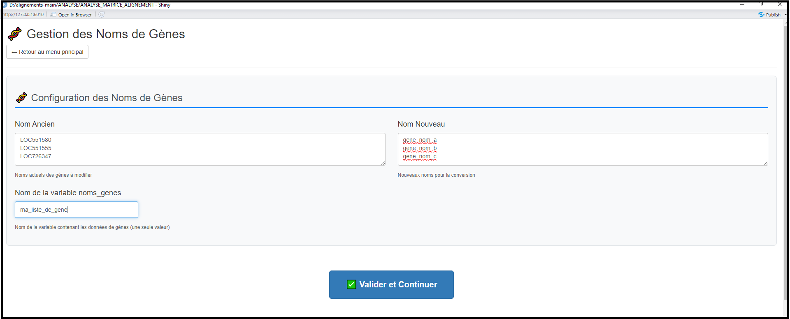

# ANALYSE_MATRICE_ALIGNEMENT

Ce script permet d'analyser des matrices d'alignements provenant de l'outil FeatureCounts 
Il necessite R4.5.1 disponible à l'adresse suivante : https://cran.r-project.org/bin/windows/base/R-4.5.1-win.exe
(Si une version antérieure à la 4.5.1 est deja installée, la desinstaller et installer la 4.5.1)

exemple de matrice d'alignement : 
"""
# Program:featureCounts v2.0.1; Command:"featureCounts" "-T" "4" "-p" "-t" "exon" "-g" "gene_id" "-a" "genomic.gtf" "-o" "counts_paired_zhang_2022_bulk.txt" "SRR15990919.bam" "SRR15990920.bam" "SRR15990921.bam" "SRR15990922.bam" "SRR15990923.bam" "SRR15990924.bam" 
Geneid	Chr	Start	End	Strand	Length	SRR15990919.bam SRR15990920.bam	SRR15990921.bam	SRR15990922.bam	SRR15990923.bam	SRR15990924.bam
LOC551580	NC_037638.1;NC_037638.1;NC_037638.1;NC_037638.1;NC_037638.1;NC_037638.1;NC_037638.1;NC_037638.1;NC_037638.1;NC_037638.1;NC_037638.1;NC_037638.1;NC_037638.1;NC_037638.1;NC_037638.1	9273;9274;9274;9779;9779;9779;10913;10913;10913;11054;11054;11054;11201;11579;11812	9546;9546;9546;9827;9827;9827;10994;10994;10994;11121;11121;11121;12174;12174;12174	-;-;-;-;-;-;-;-;-;-;-;-;-;-;-	1447	185	243	155	158	278	404
LOC551555	NC_037638.1;NC_037638.1;NC_037638.1;NC_037638.1;NC_037638.1;NC_037638.1;NC_037638.1;NC_037638.1;NC_037638.1;NC_037638.1;NC_037638.1;NC_037638.1;NC_037638.1;NC_037638.1;NC_037638.1;NC_037638.1;NC_037638.1;NC_037638.1;NC_037638.1;NC_037638.1;NC_037638.1;NC_037638.1;NC_037638.1;NC_037638.1;NC_037638.1	10792;12282;12292;12292;12641;12641;12641;12641;13126;13126;13126;13126;13941;13941;13941;13941;15180;16567;16567;16567;16567;16863;16863;16863;16863	11068;12521;12525;12525;13012;13012;13012;13012;13632;13632;13632;13632;15095;16474;16474;16474;16474;16784;16784;16784;16784;17180;17180;17180;17179	+;+;+;+;+;+;+;+;+;+;+;+;+;+;+;+;+;+;+;+;+;+;+;+;+	4470	2763	2392	1760	2237	2734	2892
LOC726347	NC_037638.1;NC_037638.1;NC_037638.1;NC_037638.1;NC_037638.1;NC_037638.1;NC_037638.1;NC_037638.1;NC_037638.1;NC_037638.1;NC_037638.1;NC_037638.1;NC_037638.1;NC_037638.1;NC_037638.1;NC_037638.1;NC_037638.1;NC_037638.1;NC_037638.1;NC_037638.1	17090;17763;17999;18266;18540;18718;18947;19237;19539;19857;20125;20313;20899;21143;21365;21665;21918;22270;22523;23064	17651;17912;18181;18475;18641;18866;19178;19287;19787;20047;20160;20638;21075;21261;21547;21825;22192;22391;22906;23457	-;-;-;-;-;-;-;-;-;-;-;-;-;-;-;-;-;-;-;-	4256	306	211	244	272	263	207
...etc
"""

utilisation du script :
ouvrir le fichier .R : ANALYSE_MATRICE_ALIGNEMENT.R et cliquer sur source (ou selectionnez l'entiereté du script et cliquer sur run)

