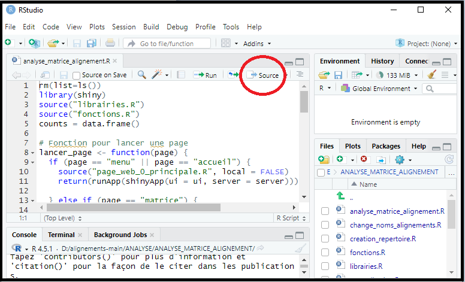
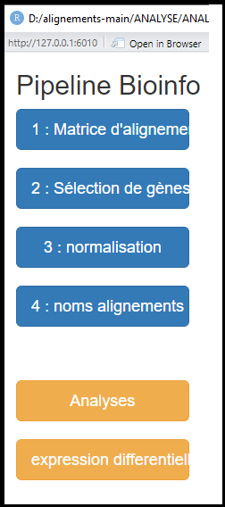
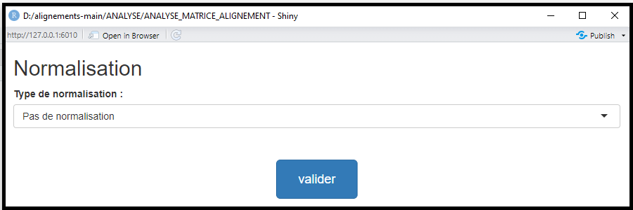

# ANALYSE_MATRICE_ALIGNEMENT

Ce script permet d'analyser des matrices d'alignements provenant de l'outil FeatureCounts 
(pour creer une matrice d'alignements : https://github.com/Michelboissac/ALIGNEMENT_READS_GENOME)
Il necessite R4.5.1 disponible à l'adresse suivante : https://cran.r-project.org/bin/windows/base/R-4.5.1-win.exe
(Si une version antérieure à la 4.5.1 est deja installée, la desinstaller et installer la 4.5.1)

utilisation du script :

ouvrir le fichier .R : ANALYSE_MATRICE_ALIGNEMENT.R et cliquer sur source (ou selectionnez l'entiereté du script et cliquer sur run) :

la fenetre suivante va s'ouvrir : 

Il faut ensuite réaliser les 4 etapes :

1)selectionner une matrice d'alignement :

2)selection de genes :

vous pouvez renter une liste de genes dans la case "nom ancien", et renommer les genes pour les visualiser dans les analyses avec la case "nom nouveau" :

vous pouvez verifier qu'un gene fait bien partit de la liste de gene de votre matrice (genome) :

3)normalisation :

4)renommer les alignements :

puis lancer ensuite les analyse :

Toutes les fonctions utilisées dans ce script sont dans le fichiers "fonctions.R",
les fonctions principale pour une analyse sont dans le fichier "test_workflow_simple_architecture.R" et peuvent etre lancé directement sans passer par l'interface graphique.

architecture du workflow : 

