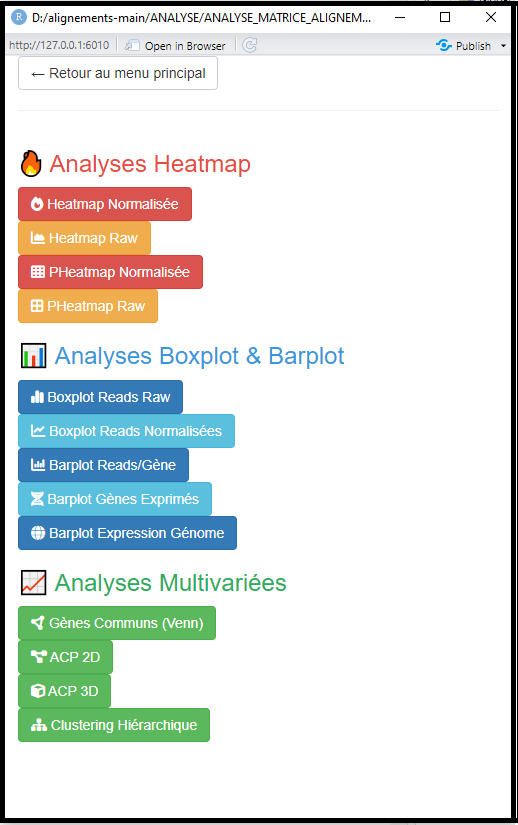
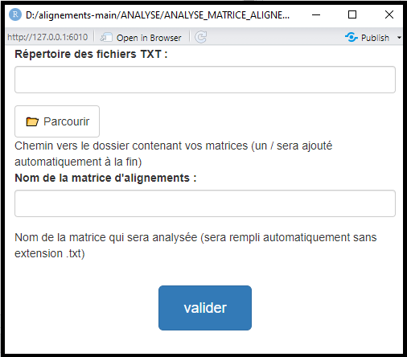

# ANALYSE_MATRICE_ALIGNEMENT

Ce script permet d'analyser des matrices d'alignements provenant de l'outil FeatureCounts 
Il necessite R4.5.1 disponible à l'adresse suivante : https://cran.r-project.org/bin/windows/base/R-4.5.1-win.exe
(Si une version antérieure à la 4.5.1 est deja installée, la desinstaller et installer la 4.5.1)

utilisation du script :
ouvrir le fichier .R : ANALYSE_MATRICE_ALIGNEMENT.R et cliquer sur source (ou selectionnez l'entiereté du script et cliquer sur run)

